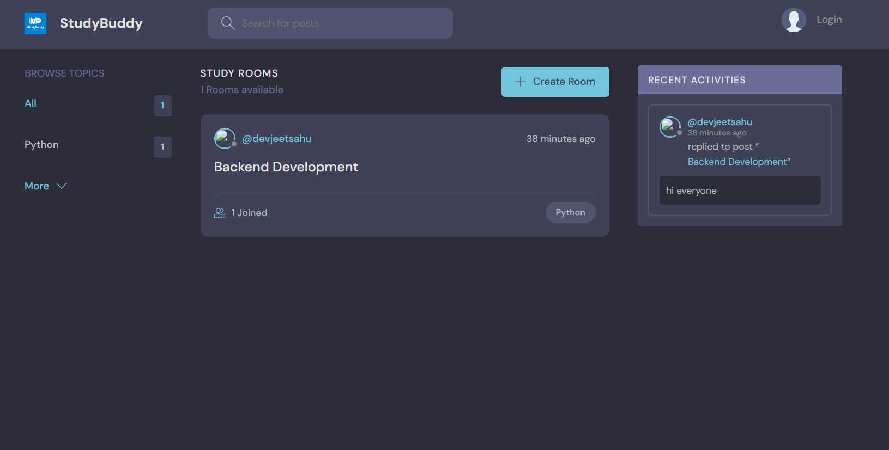
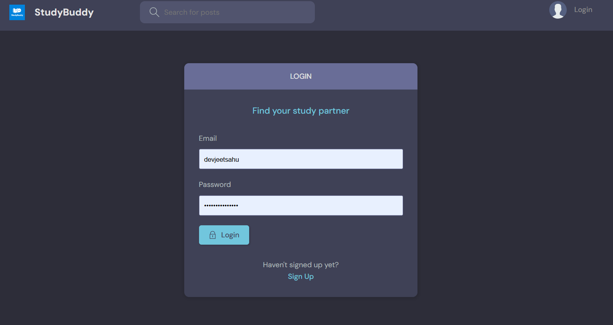
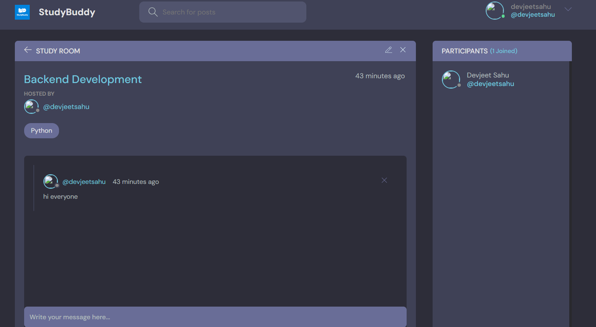

# 📚 StudyBuddy

**StudyBuddy** is a web application built with **Django** that enables users to collaborate and interact in topic-based virtual rooms. Users can create rooms, post messages, maintain profiles, and explore study activities by topic or participation.

The site is live at (https://study-buddy-r6ct.onrender.com/)
---

## 🚀 Features

- ✅ User Authentication (Login/Register)
- ✅ Create and Join Topic-based Study Rooms
- ✅ Real-time Messaging within Rooms
- ✅ View User Profiles and Activity
- ✅ Filter Rooms by Topic
- ✅ Admin Message Deletion (for own messages)
- ✅ Upload Avatar Images

---

## 🏗️ Tech Stack

- **Backend**: Django 4.x, SQLite3 (default)
- **Frontend**: HTML, CSS, Django Templates
- **Auth**: Django built-in User model (customizable)
- **Deployment**: Render

---

## 🖥️ Screenshots





## 📦 Installation

1. **Clone the repository**
   ```bash
   git clone https://github.com/your-username/studybuddy.git
   cd studybuddy
   ```

2. **Create a virtual environment**
   ```bash
   python -m venv env
   source env/bin/activate      # Linux/macOS
   env\Scripts\activate         # Windows
   ```

3. **Install dependencies**
   ```bash
   pip install -r requirements.txt
   ```

4. **Set up the database**
   ```bash
   python manage.py makemigrations
   python manage.py migrate
   ```

5. **Create superuser (admin)**
   ```bash
   python manage.py createsuperuser
   ```

6. **Run the development server**
   ```bash
   python manage.py runserver
   ```

7. Open your browser at `http://127.0.0.1:8000`

---

## 📁 Directory Structure

```
studybuddy/
├── base/              # Core app with models, views, templates
│   ├── templates/
│   ├── static/
│   ├── models.py
│   └── views.py
├── templates/         # Shared templates (e.g. navbar, layout)
├── db.sqlite3
├── manage.py
└── requirements.txt
```


## ✍️ Contributing

Pull requests are welcome. For major changes, please open an issue first to discuss what you would like to change or add.

---

## 📜 License

This project is open source and available under the [MIT License](LICENSE).

---

## 🙌 Acknowledgements

- Inspired by the Dennis Ivy's Django tutorial

---

## ✍️ Author

Made with ❤️ by [Devjeet Sahu](https://github.com/DevjeetSahu)
